# Windows Enterprise Helpdesk Lab

A hands-on Windows enterprise support lab built in VirtualBox to demonstrate practical helpdesk and junior systems-administration skills: Active Directory, Group Policy, DNS, SMB/NTFS permissions, delegated administration, PowerShell automation, and structured troubleshooting.

**Status:** feature-complete portfolio project  
**Domain:** `corp.lucalab.test`  
**Network:** `LAB-NET` — `10.10.10.0/24`

## Architecture

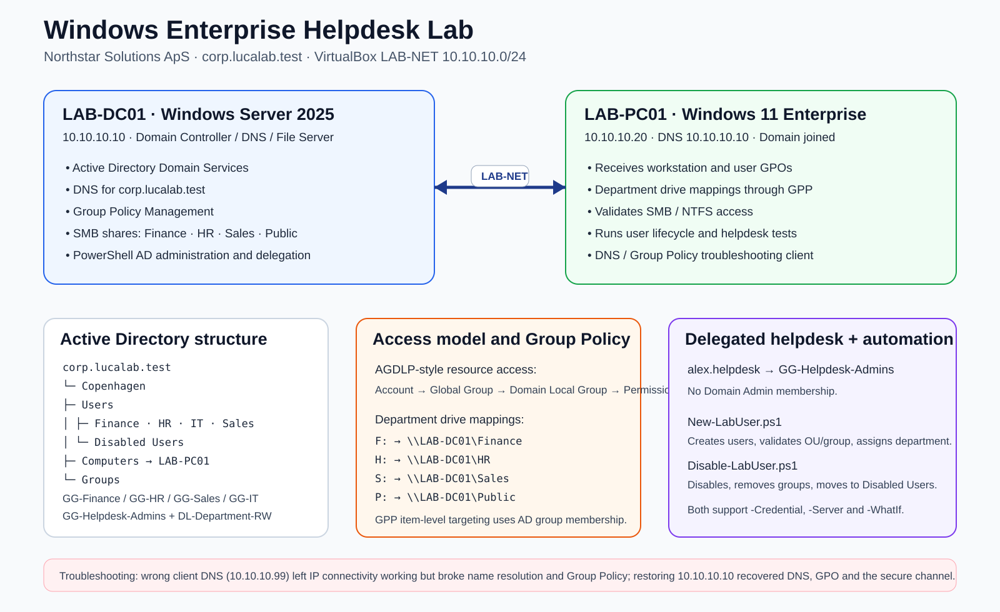

| System | Platform | Address | Role |
|---|---|---:|---|
| `LAB-DC01` | Windows Server 2025 | `10.10.10.10` | AD DS, DNS, Group Policy, SMB |
| `LAB-PC01` | Windows 11 Enterprise | `10.10.10.20` | Domain-joined client and troubleshooting workstation |

## What this lab demonstrates

### Active Directory and access control

The domain uses a structured Copenhagen OU hierarchy for departmental users, workstations, groups, and disabled accounts. Department access follows an AGDLP-style model:

```text
Account → Global Group → Domain Local Group → Resource Permission
```

For example, a Finance employee is placed in `GG-Finance`; that group is nested into `DL-Finance-RW`, which receives the Finance SMB/NTFS permissions.

### File shares and Group Policy

Centralized shares are hosted on `LAB-DC01`:

- `\\LAB-DC01\Finance`
- `\\LAB-DC01\HR`
- `\\LAB-DC01\Sales`
- `\\LAB-DC01\Public`

Group Policy Preferences maps department drives by AD group membership:

| Target | Drive | Share |
|---|---:|---|
| `GG-Finance` | `F:` | `\\LAB-DC01\Finance` |
| `GG-HR` | `H:` | `\\LAB-DC01\HR` |
| `GG-Sales` | `S:` | `\\LAB-DC01\Sales` |
| Domain users | `P:` | `\\LAB-DC01\Public` |

The lab also includes separate workstation and user baseline GPOs.

### Least-privilege helpdesk administration

`alex.helpdesk` is a normal IT account and member of `GG-Helpdesk-Admins`, but not Domain Admins. Scoped delegation allows routine user lifecycle tasks without broad administrative rights.

Two PowerShell scripts implement the workflow:

- [`New-LabUser.ps1`](scripts/New-LabUser.ps1) — validates inputs, creates the employee in the correct OU, assigns the department group, and verifies the result.
- [`Disable-LabUser.ps1`](scripts/Disable-LabUser.ps1) — protects privileged accounts, disables the employee, removes explicit memberships, moves the account to Disabled Users, and verifies the final state.

Both support delegated `-Credential`, explicit `-Server`, `-WhatIf`, and confirmation controls.

### DNS / domain troubleshooting

A controlled fault was introduced by changing `LAB-PC01` DNS from `10.10.10.10` to `10.10.10.99`.

The result isolated DNS as the cause:

```text
IP connectivity to LAB-DC01       works
TCP 445 by IP                     works
DNS resolution                    fails
SMB by FQDN                       fails
Group Policy update               fails
```

After restoring DNS to `10.10.10.10` and clearing the resolver cache, name resolution and Group Policy recovered and `Test-ComputerSecureChannel` returned `True`.

## Evidence

### Active Directory and permissions

<table>
<tr>
<td width="50%">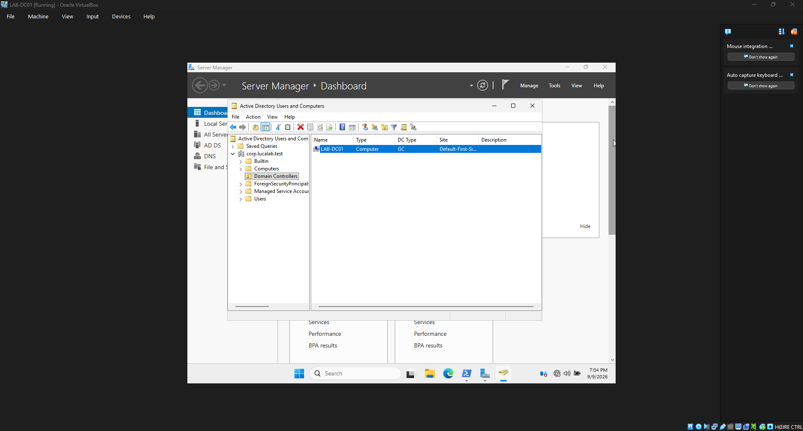<br><b>Domain controller</b></td>
<td width="50%">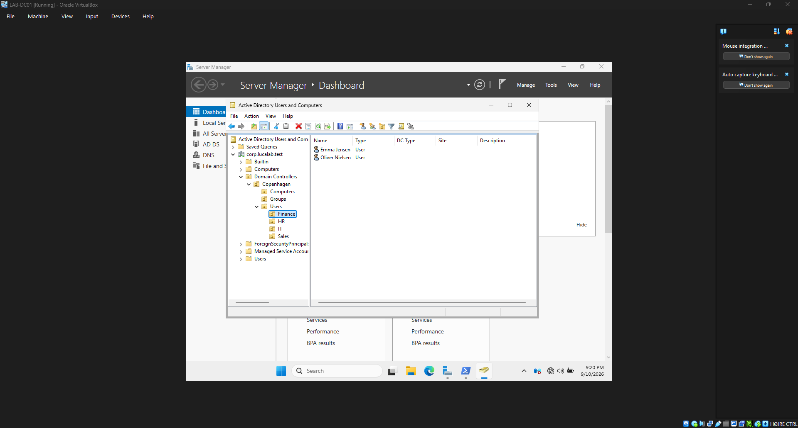<br><b>Department OU structure</b></td>
</tr>
<tr>
<td>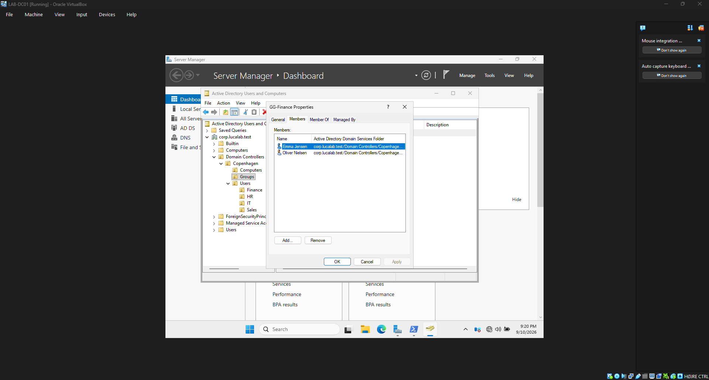<br><b>Finance security-group membership</b></td>
<td>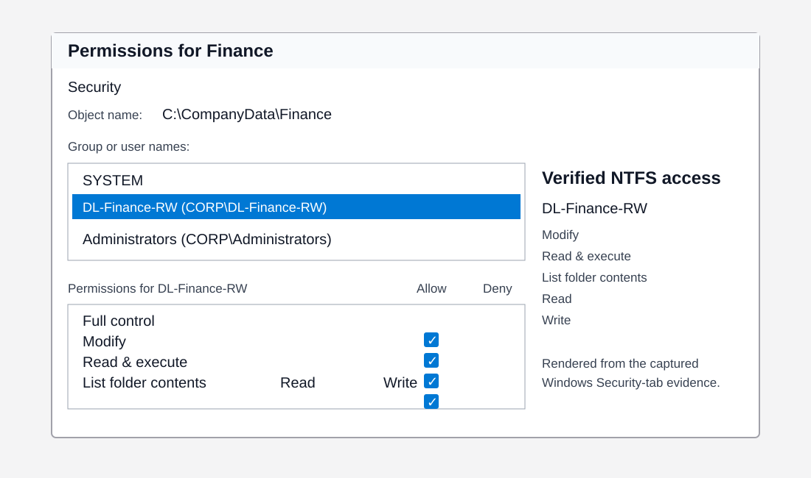<br><b>Finance NTFS permissions</b></td>
</tr>
</table>

### Group Policy and delegated administration

<table>
<tr>
<td width="50%"><br><b>Group Policy drive mappings</b></td>
<td width="50%">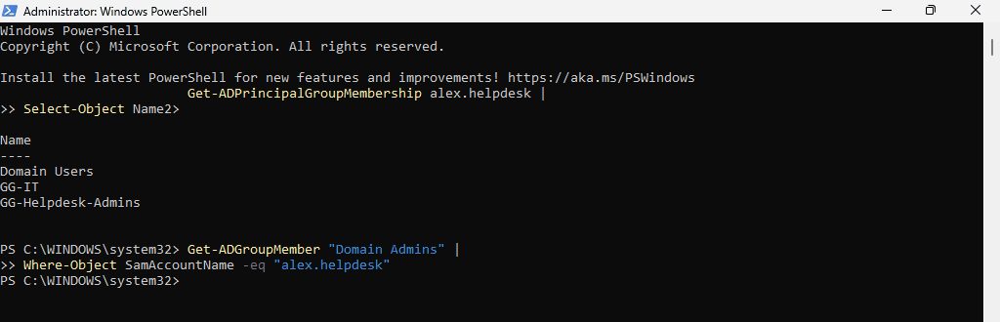<br><b>Delegated helpdesk membership</b></td>
</tr>
<tr>
<td colspan="2">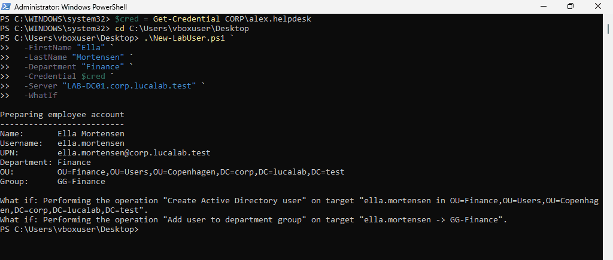<br><b>Safe onboarding preview using -WhatIf</b></td>
</tr>
</table>

### Lifecycle and troubleshooting verification

The following evidence panels are rendered from the captured PowerShell output so the results remain readable in the repository.

<table>
<tr>
<td width="50%">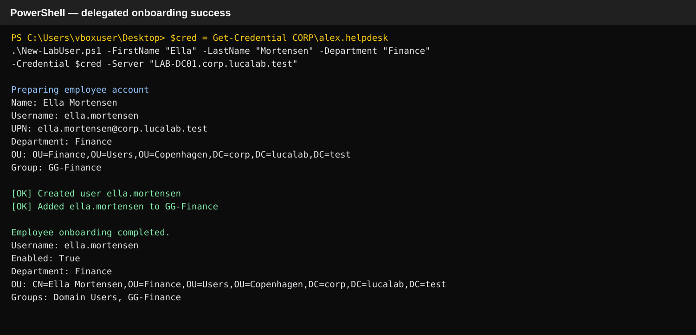<br><b>Delegated onboarding success</b></td>
<td width="50%">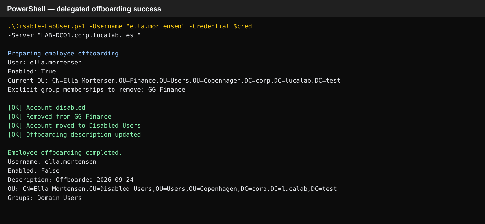<br><b>Delegated offboarding success</b></td>
</tr>
<tr>
<td>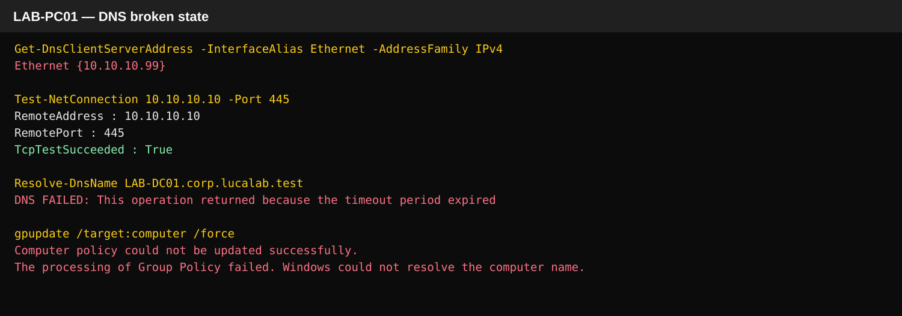<br><b>DNS failure state</b></td>
<td>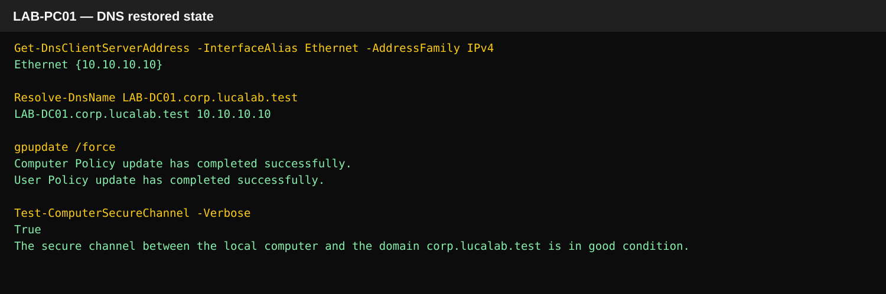<br><b>DNS recovery state</b></td>
</tr>
</table>

## Troubleshooting tickets

The repository documents real configuration faults encountered or deliberately reproduced during the project:

1. [Finance share access](tickets/001-finance-share-access.md)
2. [Workstation inherited Domain Controller policy](tickets/002-workstation-inherited-domain-controller-policy.md)
3. [User GPOs not applying](tickets/003-user-gpo-not-applying.md)
4. [Workstation GPO computer settings disabled](tickets/004-workstation-gpo-computer-settings-disabled.md)
5. [Incorrect DNS configuration breaks domain services](tickets/005-incorrect-dns-breaks-domain-services.md)

## Documentation

- [Architecture](docs/architecture.md)
- [Active Directory](docs/active-directory.md)
- [Directory structure](docs/directory-structure.md)
- [Workstation domain join](docs/workstation-domain-join.md)
- [File sharing and permissions](docs/file-sharing-and-permissions.md)
- [Group Policy](docs/group-policy.md)
- [User onboarding](docs/user-onboarding.md)
- [User offboarding](docs/user-offboarding.md)
- [Delegated helpdesk administration](docs/delegated-helpdesk-administration.md)
- [PowerShell automation safety](docs/powershell-automation-safety.md)
- [DNS and network troubleshooting](docs/dns-network-troubleshooting.md)

## Skills demonstrated

- Windows Server and Windows 11 administration
- Active Directory users, groups, computers, and OUs
- DNS and domain discovery
- Group Policy Management and Group Policy Preferences
- SMB file sharing and NTFS permissions
- AGDLP-style access control
- delegated least-privilege administration
- PowerShell AD automation
- `SupportsShouldProcess`, `-WhatIf`, and confirmation handling
- RSOP / `gpresult`
- `Resolve-DnsName`, `Test-NetConnection`, `nltest`, and secure-channel validation
- Windows event-based troubleshooting and root-cause analysis
- technical documentation

## Purpose

This project is designed as portfolio evidence for entry-level IT Support, Service Desk, IT Technician, and Junior IT Operations roles. It shows the configuration, validation, automation, and troubleshooting process behind a small Windows domain rather than only listing technologies on a CV.
